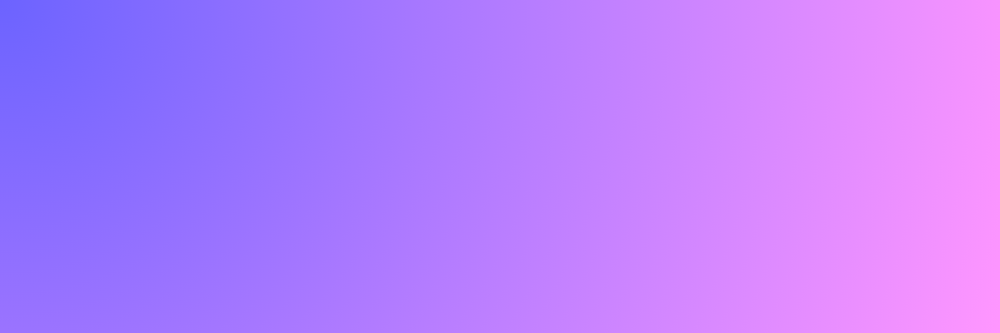

<!-- Banner personalizado -->

  

# ✨ Oi, eu sou a Valen!  

🎨 Designer | 💻 Frontend Dev | 📊 UX/UI Enthusiast  

Sou estudante de **Design na UFJF**, apaixonada por criar **interfaces criativas e funcionais**.  
Adoro unir **design e código** para transformar ideias em experiências digitais incríveis.  

---

## 🚀 Skills
## 🚀 Skills

<table>
  <tr>
    <td align="center">
      
      
HTML5

    </td>
    <td align="center">
      
      
CSS3

    </td>
    <td align="center">
      
      
JavaScript

    </td>
    <td align="center">
      
      
React

    </td>
  </tr>
</table>

---

## 📌 Projetos em Destaque
- 🌐 [Meu Portfólio](https://valenveig.github.io)  
- 📋 [Formulário de Satisfação](https://valenveig.github.io/formulario-satisfacao)  

---

## 💌 Onde me encontrar

  

